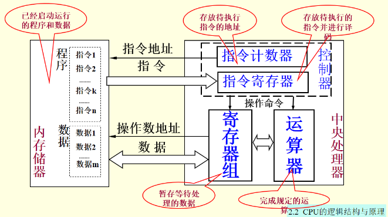

# 大学计算机信息技术教程

## 第一章 信息技术概述

### 信息与信息处理

* 信息是客观世界中*各种事物运动状态*和*变化内容*的反映，是认识主体对客观事物状态和变化的感知  
信息是事物运动状态和状态变化的方式
* 信息的性质
  * 普遍性
    * 凡是有事物的地方，就必然存在信息，信息广泛存在
  * 动态性
    * 事物是在不断运动变化中的，信息也必然随之而改变
  * 时效性
    * 由于信息的动态性，信息的使用价值会随时间而衰减
  * 多样性
    * 语言 文字 声音 图片等（统称为信息的载体或媒体）都是信息的表现形式
  * 可传递性
    * 信息可通过媒体在 人-人 人-物 物-物 之间传递 信息传递才能发挥信息的作用
  * 可共享性
    * 可无限进行使用，不会有损耗
  * 快速增长性（信息爆炸）
    * 信息随社会发展而快速增长
* 表现形式
  * 声音 图片 温度 体积 颜色 等等
* 分类
  * 交通信息 财经信息 天气信息 生物信息
* 信息处理
  * 收集 - 例如 感知 测量 获取 输入
  * 加工 - 例如 分类 计算 分析
  * 存储 - 例如 书写 摄影 录音 录像
  * 传递 - 例如 邮寄 出版 电话 电视
  * 施用 - 例如 控制 显示 导航 机器人

### 信息技术与信息产业

* 用来扩展人们信息器官功能 借助人们更有效地进行信息处理的一类技术
* 基本的信息技术
  * 感觉器官 - 感测（获取）与识别技术
  * 神经系统 - 通信技术
  * 大脑 - 计算（处理）与存储技术
  * 效应器官 - 控制与显示技术
* 现代电子信息技术的主要特征
  * 以数字技术（计算机）为基础，软件与通信技术为核心，采用电子技术（包括激光技术）进行信息的收集 传递 加工 存储 显示 控制
* 领域
  * 通信 广播 计算机 互联网 微电子 遥感遥测 自动控制 机器人
* 信息产业
  * 是战略性先导产业
  * 高投入 高风险 增长快 变动大
  * 已成为全球第一大产业
  
### 信息化与信息社会

* 信息技术引发了第三次工业革命
* 从工业社会向信息社会转型
* 利用现代信息技术对人类社会的信息和知识的生产与传播进行全面改造，使人类社会生产体系的组织结构和经济结构发生全面变革的一个过程，是一个推动人类社会从工业社会向信息社会转变的社会转型过程

### 数字技术

* 只用有限个状态(0 1)来表示
* 处理对象:比特 bit
  * 只有两种状态 0 或 1
  * 数字技术中信息的最小单位
  * 许多情况下比特只是一种符号 没有数量的概念
  * 有时表示数值，有时文字和符号，有时图像，声音
  * 运用
    * 8bit 西文字符(ascii) 256灰阶的灰度图像
    * 16bit 汉字(gb系列) utf-16
    * 32bit x86CPU内存地址 ipv4地址 RGB单个像素
    * 40bit wifi密钥长度
    * 48bit mac地址长度
    * 64bit x64CPU内存地址
    * 128bit ipv6地址 sim卡中用于身份验证的密钥
    * 1024bit U盾中RSA的密钥
  * 存储
    * 分类
      * 易失性存储器
        * 寄存器和大多数半导体存储器在电源切断后会丢失信息
      * 非易失性存储器
        * 磁盘 U盘 光盘 断电后也能保持所存储的信息不变
    * 种类
      * 触发器(寄存器)(sram)
        * 双稳态电子线路
      * 电容器(dram)
        * 内存
      * 磁盘
        * 利用磁介质表面区域的磁化状态来存储
      * 光盘
        * 刻在光盘表面上的微小凹坑来记录
    * 单位
      * 计算机使用(2^10 = 1024) 网络和硬盘厂商使用(1000)
      * 名称
        * B 字节
        * KB 千字节
        * MB 兆字节
        * GB 吉字节
        * TB 太字节
  * 二进制
    * 转换
      * 十进制
        * 整数
          * 除以二 逆序
        * 小数
          * 乘以二 顺序
      * 八进制
        * 三位一转
      * 十六进制
        * 四位一转
    * 存储
      * 整数
        * 无符号
          * 范围[0, 2^n - 1]
          * 可表示地址 索引
        * 有符号
          * 补码
            * 范围[-2^(n-1), 2^(n-1) - 1]
        * 编码
          * 原码
            * 采用前置bool标志符号(sign bit)
          * 反码
            * 负数取反 正不变
          * 补码
            * 首位负权
          * 移码
            * 定义基准值B 实际存储N = 表示数字n + B
      * 实数(小数 real)
        * 浮点
          * 只能近似
          * IEEE754规定编码格式
            * 前置bool符号位 指数移码 尾数
        * 定点
          * 预先规定小数点位置
          * 例如
            * 8bit定点数 第四bit后为小数点  
            0101 1000  
            则为101.1  
            十进制为5.5
      * 文字
        * ascii每个字符使用7bit 但是计算机基本储存单位是B 则使用8bit存放
        * gb系使用 1B储存西文字符 2B储存中文字符
      * 图像
        * 单个像素
          * RGBA
            * 位深度 32bit
            * 红 绿 蓝 透明 各1B
          * RGB
            * 位深度 24bit
          * 灰度
            * 位深度 8bit
          * 黑白
            * 位深度 1bit
  * 比特的运算
    * 信息的处理在计算机中都是通过比特的运算完成的
    * 基本逻辑运算
      * 逻辑加 ∨ 或
      * 逻辑乘 ∧ 与
      * 取反 非
  * 使用以比特为核心的数字技术来构造和开发各种信息系统是信息技术发展的总趋势，也是信息技术发展的一种必然

### 微电子技术

* 微电子技术是实现电子电路和电子系统超小型化及微型化的技术，它以集成电路为核心
* 集成电路IC
  * 早期
    * 以半导体单晶片作为材料，经平面工艺加工制造，将大量晶体管 电阻 电容及连线构成的电子线路集成在基片上，构成一个微型化电路或系统
  * 现代
    * 以硅或其他材料(砷化镓)作为半导体材料
  * 分类
    * 小规模集成电路(<100)
    * 中规模集成电路(100-3000)
    * 大规模集成电路(3000-10万)
    * 超大规模集成电路(10万-100万)
    * 极大规模集成电路(>100万)
  * 是微电子技术的结晶 是计算机 通信 几乎所有电子设备的硬件核心，是现代信息产业的基础
  * 特点 体积小 功耗低 速度快 可靠性高
  * 尺寸越小 则工作频率越高 门电路开关速度越快
  * 线条越细 可容纳的晶体管就越多 功能越强 速度越快
  * 摩尔定律
    * Intel公司创始人之一 摩尔(Moore) 在美国<电子学>杂志上发表论文预测 单块集成电路的集成度平均**18~24**个月翻一番
  * 制造过程
    * 在硅衬底上制作而成
    * 步骤
      1. 将单晶硅 切割 研磨 抛光 制成硅抛光片
      2. 严格清洗 氧化 光刻 掺杂 互连 制成晶圆(具有多个集成电路)
      3. 对晶圆上每个集成电路检测 切割 制成晶片
      4. 固定在塑胶或陶瓷的基座上 安装 盖上盖板封焊 制成集成电路成品
* IC卡
  * 存储 处理 传递数据的载体 (与磁卡相比)不受磁场影响 能可靠的存储和处理数据
  * 分类
    * 存储器卡
      * 校园卡 公交卡 医保卡 门禁卡
    * CPU卡 (智能卡)
      * SIM卡
    * 接触式IC卡
      * 如SIM卡 有镀金触点
      * 多用于存储信息量大 读写较复杂的场合
      * 易磨损 怕油污 寿命不长
    * 非接触式IC卡
      * 用电磁感应方式无线传输数据
      * **第二代身份证**
    * 双界面卡
      * 支持接触式和非接触式
      * 如银行IC卡
      * 安全性高 信息难以复制
  * SIM卡
    * 开机入网流程
      1. 输入PIN码 SIM核对无误后将IMSI代码传送给手机
      2. 手机通过移动通信网络将IMSI代码发送给服务器
      3. 服务器根据IMSI找到该用户的密钥Ki 并生成随机数RAND发送给手机
      4. SIM卡 按照预定的加密算法和Ki对RAND加密 由手机发送给服务器
      5. 服务器验证结果
      6. 相同则通过，手机获得通信授权
    * PIN码
      * 个人识别码
      * 是SIM卡的密码
      * 三次后上锁
    * PUK
      * 解锁码
      * 上锁后输入PUK解锁
      * 10次后使SIM卡失效
* 电子标签
  * RFID

## 第二章 计算机组成原理

### 计算机的发展

* [第1-4代计算机的对比](#第1-4代计算机的对比)
* 应用模式变化
  * 集中计算 70年代前
  * 分散计算 70年代
  * 网络计算 90年代
  * 云计算   现在
* 第一台计算机
  * 1946年 数字电子计算机 ENIAC(埃尼阿克) 美国宾州大学(美国宾夕法尼亚大学)
* **FORTRAN** 第一个高级程序设计语言
* 复杂性：硬件由数以亿计的元器件组成，软件由数以亿计的指令组成
* 多样性：硬件与光、机、电、声等有关，软件与数学、逻辑···等有关
* 层次性：分层(hierarchical) 结构
* 模块化：每一层均由许多模块构成
* 新型材料：量子计算机 光学计算机 生物计算机

### 结构

* 冯·诺依曼结构  

  * 采用存储程序方式
  * 存储器是按地址访问的线性编址的一维结构
  * 指令由操作码和地址码组成。
  * 通过执行指令直接发出控制信号控制计算机的操作。
  * 以运算器为中心，I/O设备与存储器间的数据传送都要经过运算器。
  * 数据以二进制表示。
  * 计算机硬件由运算器、控制器、存储器、输入设备和输出设备五大部分组成。

### 计算机

* 一种信息处理工具
* 分类
  * 巨型计算机
  * 大型计算机
  * 小型计算机(服务器)
  * 个人计算机
    * 台式PC
    * 便携 (笔记本PC 平板电脑等)
      * 手机
        * 分类：
          * 按照可接入的移动通信网技术划分：
            * 1G手机（俗称“大哥大”，模拟手机）
            * 2G手机（GSM或CDMA手机）
            * 3G手机（国内有3种制式）
            * 4G手机（TDD-LTE和FDD-LTE）
          * 按照手机的功能划分：
            * 笨手机（dumb phone）：除电话之外很少其他功能
            * 功能手机（feature phone）：除了通话功能之外，还具有收发短信、通讯录、计算器、收音、录音、照相等功能
            * 智能手机（smart phone）：比功能手机更丰富多样，它可以像PC个人电脑一样安装第3方软件，不断扩充其功能。而功能手机通常不能随意安装和卸载软件。
  * 嵌入式计算机(单片机)
    * 把运算器 控制器 存储器 输入输出控制 接口电路 全集中在一块芯片上

### 组成

* 概念
  * 硬件
    * 是计算机系统中所有实际物理装置的总称
  * 软件
    * 在计算机中运行的各种程序及其处理的数据和相关的文档
    * 程序
      * 指挥硬件自动进行规定的操作
    * 数据
      * 程序所处理的对象
    * 文档
      * 软件设计报告 操作说明
* 硬件
  * 逻辑上硬件包括CPU 主存储器 辅存 输入输出设备 并通过总线互相连接
  * CPU
    * 能高速执行指令完成二进制数据的算数 逻辑运算和数据传送
    * 一台计算机往往有多个处理器 也可以有多个中央处理器
    * 并行
      * 由多个处理器核心同时处理多个任务
    * 并发
      * 由单个处理器核心流水线式处理多个任务
  * 主存 辅存
    * 把程序和数据存储起来的部件
    * 主存
      * 存取速度快 容量小
      * 一般是易失性
      * 与CPU高速连接 按字节编址
      * 存放运行中的程序代码和需要处理的数据
    * 辅存
      * 存取速度慢 容量大
      * 一般是非易失性
      * 需要传送到主存 按数据块编址
      * 长期存放计算机系统中几乎所有信息
  * 输入设备
    * 向计算机输入
    * 使用二进制位表示数据
  * 输出设备
    * 送出计算机
    * 把计算机的二进制数据转换成人可识别 感知的形式
  * 总线 IO接口  
  
    * CPU 主存 辅存 输入输出设备之间传输信息并协调它们工作的一种部件
    * 传输线(数据) 控制电路
    * CPU总线
      * 连接CPU 主存
    * IO总线
      * 连接主存和IO设备

### CPU的结构与原理

* 有一个或多个CPU核心 高速缓存 存储控制器 甚至图形处理器
* 从内存中一条一条的取出指令和相应的数据
* CPU的根本任务是执行指令
* 结构  
  
  * 寄存器组
    * 存取速度快
  * 运算器(ALU)
    * 数据来自于寄存器或内存
    * 运算结果送回寄存器或内存
  * 控制器
    * 有一个指令计数器
      * 存放当前指令地址
      * 每执行完+1
    * 指令寄存器
      * 存放当前指令
* 指令
  * 构成程序的基本单位
  * 采用二进制位表示
  * 操作码
    * 与每个命令一一对应(指令集)
  * 操作数地址
    * 寄存器编号或主存地址
    * 数量由操作码决定
  * CPU执行流程
    * **取指** : 从存储器读取指令字节
    * **译码** : 读出操作码与其对应的操作数
    * **执行** : 根据操作码对操作数完成运算
    * 访存 : 读写存储器(主存)
    * **写回** : 保存至寄存器
    * 更新PC([指令计数器](#CPU的结构与原理)) : 将PC设置为下一条指令地址
* 概念
  * 字长
    * CPU中通用寄存器/定点运算器的宽度
    * 大体决定了地址码位数, 地址码位数决定了CPU可访问的最大内存空间
    * 中低端的嵌入式计算机大多是8位 16位 32位的cpu 高端智能手机 现代个人计算机都是 64位cpu
  * 主频(CPU时钟频率)
    * 决定着cpu芯片内部数据传输与操作速度的快慢
    * cpu的速度不仅与主频有关 而且与每个时钟周期能完成几条指令有关
  * 高速缓存
    * 通常 cache容量越大 级数越多 效用就越显著
  * 指令系统
  * 逻辑结构(微架构)
  * cpu核
    * 2个核的cpu性能不是单核的2倍
  * 复杂指令集(CISC)/精简指令集(RISC)
    * CISC
      * 变长(长度不等)
      * 功能多
      * 导致CPU结构复杂 功耗大
    * RISC
      * 长度统一
      * 指令数量少
      * 执行时间短 功耗小

### 主板 内存 IO

* 主板
  * cpu插座 芯片组 存储器插座 扩充卡插座 显卡插座 BIOS CMOS存储器 辅助芯片 和 IO接口
  * 芯片组
    * 各个组件相互连接和通信的枢纽 实现了PC总线的控制功能 提供了各种IO接口及相关的控制
    * 智能手机主板上没有芯片组
    * 北桥芯片
      * 负责与CPU的联系并控制内存AGP数据在北桥内部传输，提供对CPU的类型和主频、系统的前端总线频率、内存的类型和最大容量、AGP插槽、ECC纠错等支持。
      * 部分集成了显示核心
      * 连接CPU 主存 显卡(PCI-E x16)
    * 南桥芯片
      * 负责I/O总线之间的通信。如PCI总线、USB、LAN、ATA、SATA、音频控制器、键盘控制器、实时时钟控制器、高级电源管理等。
* BIOS
  * 由闪存(非易失性存储器)存储
  * 是PC启动时最先运行的软件
  * 功能
    * 加电自检
    * 系统盘主引导载入
    * CMOS设置程序
    * 基本外设驱动
* CMOS存储器
  * 存放配置信息 比如 当前日期时间
  * 易失性存储器 由主板电池供电 关机后不会丢失数据
  
### 存储器

* 一般 容量越小 速度越快
* 电路
  * RAM
    * 易失性存储器
    * DRAM
      * 动态随机存取存储器
      * 电路简单 集成度高 功耗小 成本低 速度较慢
      * 内存
    * SRAM
      * 静态随机存取存储器
      * 电路复杂 集成度低 功耗大 成本高 速度快
      * 寄存器
  * ROM
    * 非易失性存储器
    * EEPROM
      * 电可擦可编程
      * 以位为单位读写
    * 闪速存储器
      * NOR型 (BIOS之类的)
        * 以字节为单位随机存取 可以直接被cpu执行
      * NAND型 (辅助存储器)
        * 以块为单位存取 要复制到ram再处理
        * 容量 使用寿命 成本有较大优势
        * 存储卡 u盘 固态硬盘(ssd)
* 主存储器
  * 由DRAM芯片组成
  * 每个存储单元 存储1个字节 拥有唯一地址
  * 存取时间为纳秒ns级
  * 机制
    * 用cache存储器
      * 在CPU中加入SRAM存储电路
    * 改进存储器芯片的结构
      * 采用多个存储整列交叉并行工作
    * 改进CPU与主存芯片连接
      * 加快cpu与主存传输速度
  * 速度计算
    * 预取 (bit)
      * DDR 2
      * DDR2 4
      * DDR3 8
      * DDR4 16
    * 数据总线位宽
      * 64bit
      * 双通道
      * 数据总线位宽*2 = 128bit
    * DDR 使用MHz为单位
    * 例如
      * DDR4 2133
      * 速度为2133 * 64bit = 136512Mb/s = 17.064GB/s
      * 内部时钟频率为2133 / 16(预取) = 133.3MHz

### IO总线

* IO操作
  * CPU执行IO指令启动IO控制器完成
  * 每个IO设备都有各自*专用*的控制器，它们接受CPU的IO命令后控制IO操作的*全过程*
  * IO操作与CPU运算可同时进行
  * 多个设备可分别同时与内存进行数据传输
  * PCI-E是PCI总线的改进
    * 采用高速串行传输以点对点的方式进行数据的传输
    * 规格(传输通路)
      * x1 x4 x8 x16
  * USB 通用串行总线  
  
    * USB2.0 60MB/s 4线
    * USB3.0 400MB/s 8线
    * 智能手机接口
  * SATA 硬盘 光盘
  * VGA DVI HDML 显示器 电视机
    * VGA采用模拟型号 后两个采用数字信号

### 常见输入输出设备

* 输入
  * 键盘
    * 电容式 击键声音小 无触点 不存在磨损或接触不良 寿命较长 手感好
    * 无线键盘 用蓝牙 红外线将输入信息传送给计算机上安装的专用接收器
    * 智能手机使用虚拟键盘
  * 鼠标器
    * 利用机电或光学原理 将移动的距离和方向分别变化成脉冲信号
    * 光电工作速度快 准确 灵敏
  * 触摸屏
    * 电阻式 电容式 电磁感应式
    * 对压力敏感
    * 电阻式仅支持单点触控
    * 电容式可以多点触控
  * 扫描仪
    * 手持式 平板式 胶片专用 滚筒式
    * 大多采用USB接口
    * 光学分辨率 单位dpi
    * 色彩位数(位深度)
  * 数码相机/摄像头
    * 将影像聚焦在*成像芯片*(CCD或CMOS)上 并输出电信号
    * 模数转换变成数字图像
    * 图像处理 数据压缩
    * 存储
    * CCD芯片
      * 由亿个CCD像素排列
        * 4：3或3：2
  * 传感器
    * 感受到被测量的信息 转换成电信号给计算机处理
    * 类别
      * 指纹传感器
      * 环境光传感器
      * 近距离传感器
      * 气压传感器
      * 三轴陀螺仪传感器
      * 重力传感器(加速度传感器)
      * 磁力计
      * 3D触摸传感器
* 输出
  * 显示器
    * 将数字信号转换成光信号
    * CRT显示器 液晶显示器(LCD)
    * 参数
      * 尺寸
        * 对角线的长度
      * 分辨率
        * 水平分辨率x垂直分辨率
      * 刷新速度
        * 每秒更新的次数
      * 响应时间
        * 像素点对电信号的反应速度
      * 色彩 亮度 对比度
      * 背光源类型
        * LCD显示器需要一个背光源
        * 现在一般采用LED
      * 辐射与环保
  * 显示卡
    * 由 显示控制电路 图形处理器 显示存储器 接口电路 组成
    * 显示控制电路
      * 对显示器进行控制
    * 主机接口电路
      * 负责显卡与CPU 内存的数据传输
  * 打印机
    * 针式打印机
      * 质量不高 噪声大 耗材成本低 能多层套打
      * 热敏打印机
    * 激光打印机
      * 激光技术与复印技术相结合的产物
      * 高质量 高速度 低噪声 价格适中
    * 喷墨打印机
      * 能输出彩色图像 经济 低噪音 效果好 不产生臭氧
      * 耗材成本高 小号快
    * 参数
      * 打印精度
        * 打印的分辨率 单位dpi
      * 打印速度
      * 色彩表现能力
      * 其他
  * 声音输出
  * 力反馈输出

### 辅助存储器

* 组成
  * 磁盘盘片 主轴和主轴电机 移动臂 磁头 控制电路
  * 用磁性材料粒子的磁化来记录数据
  * 部分盘面 两面都可以记录数据
  * 每个盘面都被划分为数目相等的磁道，并从外缘的“0”开始编号，具有相同编号的磁道形成一个圆柱，称之为磁盘的柱面
  * 同心圆磁道(光盘的光道是从内向外的螺旋线)
  * 每个磁道上一个弧段被称之为一个扇区
  * 磁盘的柱面数与一个盘面上的磁道数是相等的
  * 盘面数等于总的磁头数
* 容量计算
  * 存储容量 ＝ 磁头数 × 磁道(柱面)数 × 每道扇区数 × 每扇区字节数
* Link [硬盘基本知识](https://blog.csdn.net/fyfcauc/article/details/39576065)
* 移动硬盘
  * 2.5寸(仅台式机械3.5寸 所有ssd和笔记本机械都是2.5)
* 注意事项
  * 读写时不能断电
  * 防止震动(2.5寸机械有防震机制 ssd完全不怕震动)
* 闪存
  * 半导体集成电路
  * 非易失性存储器
  * 抗震性好 耐受高压高温 没有机械运动部件 存取速度快 无噪音 尺寸小 轻便
  * 写入过程复杂 写入速度慢于读出
  * 写入次数有限制
  * 数据损坏后难以修复
  * 性价比低
* 参数
  * 容量
  * 平均存取时间
  * 缓存容量
  * 数据传输速率
* 光盘
  * 使用螺旋形光道记录数据
  * 凹坑边缘表示1 凹坑内外的平坦部分表示0
  * 光驱用SATA或USB连接电脑
  * 

### 第1-4代计算机的对比

| 代别  | 年代                          | 使用的主要元器件                                                     | 使用的软件类型                               | 主要应用领域                            |
| ----- | ----------------------------- | -------------------------------------------------------------------- | -------------------------------------------- | --------------------------------------- |
| 第1代 | 20世纪40年代中期-50年代末期   | CPU：电子管(真空管) 内存：磁鼓                                  | 使用机器语言和汇编语言编写程序               | 科学和工程计算                          |
| 第2代 | 20世纪50年代中后期-60年代中期 | CPU：晶体管 内存：磁芯                                          | 使用**FORTRAN** COBOL 等高级程序设计语言编程 | 数据处理                                |
| 第3代 | 20世纪60年代中期-70年代初期   | CPU：中小规模集成电路(SSI MSI) 内存：SSI MSI的半导体存储器      | 操作系统 数据库管理系统 普遍使用             | 科学计算、事务处理与分析、工业控制      |
| 第4代 | 20世纪70年代中期-现在         | CPU：大 超大规模集成电路(LSI VLSI) 内存：LSI VLSI的半导体存储器 | 软件开发工具和平台 分布式计算软件 广泛使用   | 深入到各行各业 家庭和个人普遍使用计算机 |

[返回](#第二章-计算机组成原理 "返回")

### Link

* [计算机组成原理（一）- 冯·诺依曼体系结构](https://www.jianshu.com/p/60871e1d3852)
