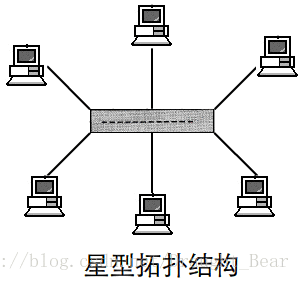
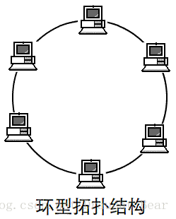
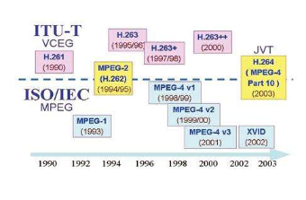

# 大学计算机信息技术教程

## 第一章 信息技术概述

### 信息与信息处理

* 信息是客观世界中*各种事物运动状态*和*变化内容*的反映，是认识主体对客观事物状态和变化的感知  
信息是事物运动状态和状态变化的方式
* 信息的性质
  * 普遍性
    * 凡是有事物的地方，就必然存在信息，信息广泛存在
  * 动态性
    * 事物是在不断运动变化中的，信息也必然随之而改变
  * 时效性
    * 由于信息的动态性，信息的使用价值会随时间而衰减
  * 多样性
    * 语言 文字 声音 图片等（统称为信息的载体或媒体）都是信息的表现形式
  * 可传递性
    * 信息可通过媒体在 人-人 人-物 物-物 之间传递 信息传递才能发挥信息的作用
  * 可共享性
    * 可无限进行使用，不会有损耗
  * 快速增长性（信息爆炸）
    * 信息随社会发展而快速增长
* 表现形式
  * 声音 图片 温度 体积 颜色 等等
* 分类
  * 交通信息 财经信息 天气信息 生物信息
* 信息处理
  * 收集 - 例如 感知 测量 获取 输入
  * 加工 - 例如 分类 计算 分析
  * 存储 - 例如 书写 摄影 录音 录像
  * 传递 - 例如 邮寄 出版 电话 电视
  * 施用 - 例如 控制 显示 导航 机器人

### 信息技术与信息产业

* 用来扩展人们信息器官功能 借助人们更有效地进行信息处理的一类技术
* 基本的信息技术
  * 感觉器官 - 感测（获取）与识别技术
  * 神经系统 - 通信技术
  * 大脑 - 计算（处理）与存储技术
  * 效应器官 - 控制与显示技术
* 现代电子信息技术的主要特征
  * 以数字技术（计算机）为基础，软件与通信技术为核心，采用电子技术（包括激光技术）进行信息的收集 传递 加工 存储 显示 控制
* 领域
  * 通信 广播 计算机 互联网 微电子 遥感遥测 自动控制 机器人
* 信息产业
  * 是战略性先导产业
  * 高投入 高风险 增长快 变动大
  * 已成为全球第一大产业
  
### 信息化与信息社会

* 信息技术引发了第三次工业革命
* 从工业社会向信息社会转型
* 利用现代信息技术对人类社会的信息和知识的生产与传播进行全面改造，使人类社会生产体系的组织结构和经济结构发生全面变革的一个过程，是一个推动人类社会从工业社会向信息社会转变的社会转型过程

### 数字技术

* 只用有限个状态(0 1)来表示
* 处理对象:比特 bit
  * 只有两种状态 0 或 1
  * 数字技术中信息的最小单位
  * 许多情况下比特只是一种符号 没有数量的概念
  * 有时表示数值，有时文字和符号，有时图像，声音
  * 运用
    * 8bit 西文字符(ascii) 256灰阶的灰度图像
    * 16bit 汉字(gb系列) utf-16
    * 32bit x86CPU内存地址 ipv4地址 RGB单个像素
    * 40bit wifi密钥长度
    * 48bit mac地址长度
    * 64bit x64CPU内存地址
    * 128bit ipv6地址 sim卡中用于身份验证的密钥
    * 1024bit U盾中RSA的密钥
  * 存储
    * 分类
      * 易失性存储器
        * 寄存器和大多数半导体存储器在电源切断后会丢失信息
      * 非易失性存储器
        * 磁盘 U盘 光盘 断电后也能保持所存储的信息不变
    * 种类
      * 触发器(寄存器)(sram)
        * 双稳态电子线路
      * 电容器(dram)
        * 内存
      * 磁盘
        * 利用磁介质表面区域的磁化状态来存储
      * 光盘
        * 刻在光盘表面上的微小凹坑来记录
    * 单位
      * 计算机使用(2^10 = 1024) 网络和硬盘厂商使用(1000)
      * 名称
        * B 字节
        * KB 千字节
        * MB 兆字节
        * GB 吉字节
        * TB 太字节
  * 二进制
    * 转换
      * 十进制
        * 整数
          * 除以二 逆序
        * 小数
          * 乘以二 顺序
      * 八进制
        * 三位一转
      * 十六进制
        * 四位一转
    * 存储
      * 整数
        * 无符号
          * 范围[0, 2^n - 1]
          * 可表示地址 索引
        * 有符号
          * 补码
            * 范围[-2^(n-1), 2^(n-1) - 1]
        * 编码
          * 原码
            * 采用前置bool标志符号(sign bit)
          * 反码
            * 负数取反 正不变
          * 补码
            * 首位负权
          * 移码
            * 定义基准值B 实际存储N = 表示数字n + B
      * 实数(小数 real)(数学: 有理数和无理数的总称)
        * 浮点
          * 只能近似
          * IEEE754规定编码格式
            * 前置bool符号位 指数移码 尾数
        * 定点
          * 预先规定小数点位置
          * 例如
            * 8bit定点数 第四bit后为小数点  
            0101 1000  
            则为101.1  
            十进制为5.5
      * 文字
        * ascii每个字符使用7bit 但是计算机基本储存单位是B 则使用8bit存放
        * gb系使用 1B储存西文字符 2B储存中文字符
      * 图像
        * 单个像素
          * RGBA
            * 位深度 32bit
            * 红 绿 蓝 透明 各1B
          * RGB
            * 位深度 24bit
          * 灰度
            * 位深度 8bit
          * 黑白
            * 位深度 1bit
  * 比特的运算
    * 信息的处理在计算机中都是通过比特的运算完成的
    * 基本逻辑运算
      * 逻辑加 ∨ 或
      * 逻辑乘 ∧ 与
      * 取反 非
  * 使用以比特为核心的数字技术来构造和开发各种信息系统是信息技术发展的总趋势，也是信息技术发展的一种必然

### 微电子技术

* 微电子技术是实现电子电路和电子系统超小型化及微型化的技术，它以集成电路为核心
* 集成电路IC
  * 早期
    * 以半导体单晶片作为材料，经平面工艺加工制造，将大量晶体管 电阻 电容及连线构成的电子线路集成在基片上，构成一个微型化电路或系统
  * 现代
    * 以硅或其他材料(砷化镓)作为半导体材料
  * 分类
    * 小规模集成电路(<100)
    * 中规模集成电路(100-3000)
    * 大规模集成电路(3000-10万)
    * 超大规模集成电路(10万-100万)
    * 极大规模集成电路(>100万)
  * 是微电子技术的结晶 是计算机 通信 几乎所有电子设备的硬件核心，是现代信息产业的基础
  * 特点 体积小 功耗低 速度快 可靠性高
  * 尺寸越小 则工作频率越高 门电路开关速度越快
  * 线条越细 可容纳的晶体管就越多 功能越强 速度越快
  * 摩尔定律
    * Intel公司创始人之一 摩尔(Moore) 在美国"电子学"杂志上发表论文预测 单块集成电路的集成度平均**18~24**个月翻一番
  * 制造过程
    * 在硅衬底上制作而成
    * 步骤
      1. 将单晶硅 切割 研磨 抛光 制成硅抛光片
      2. 严格清洗 氧化 光刻 掺杂 互连 制成晶圆(具有多个集成电路)
      3. 对晶圆上每个集成电路检测 切割 制成晶片
      4. 固定在塑胶或陶瓷的基座上 安装 盖上盖板封焊 制成集成电路成品
* IC卡
  * 存储 处理 传递数据的载体 (与磁卡相比)不受磁场影响 能可靠的存储和处理数据
  * 分类
    * 存储器卡
      * 校园卡 公交卡 医保卡 门禁卡
    * CPU卡 (智能卡)
      * SIM卡
    * 接触式IC卡
      * 如SIM卡 有镀金触点
      * 多用于存储信息量大 读写较复杂的场合
      * 易磨损 怕油污 寿命不长
    * 非接触式IC卡
      * 用电磁感应方式无线传输数据
      * **第二代身份证**
    * 双界面卡
      * 支持接触式和非接触式
      * 如银行IC卡
      * 安全性高 信息难以复制
  * SIM卡
    * 开机入网流程
      1. 输入PIN码 SIM核对无误后将IMSI代码传送给手机
      2. 手机通过移动通信网络将IMSI代码发送给服务器
      3. 服务器根据IMSI找到该用户的密钥Ki 并生成随机数RAND发送给手机
      4. SIM卡 按照预定的加密算法和Ki对RAND加密 由手机发送给服务器
      5. 服务器验证结果
      6. 相同则通过，手机获得通信授权
    * PIN码
      * 个人识别码
      * 是SIM卡的密码
      * 三次后上锁
    * PUK
      * 解锁码
      * 上锁后输入PUK解锁
      * 10次后使SIM卡失效
* 电子标签
  * RFID

## 第二章 计算机组成原理

### 计算机的发展

* [第1-4代计算机的对比](#第1-4代计算机的对比)
* 应用模式变化
  * 集中计算 70年代前
  * 分散计算 70年代
  * 网络计算 90年代
  * 云计算   现在
* 第一台计算机
  * 1946年 数字电子计算机 ENIAC(埃尼阿克) 美国宾州大学(美国宾夕法尼亚大学)
* **FORTRAN** 第一个高级程序设计语言
* 复杂性：硬件由数以亿计的元器件组成，软件由数以亿计的指令组成
* 多样性：硬件与光、机、电、声等有关，软件与数学、逻辑···等有关
* 层次性：分层(hierarchical) 结构
* 模块化：每一层均由许多模块构成
* 新型材料：量子计算机 光学计算机 生物计算机

### 结构

* 冯·诺依曼结构  

  * 采用存储程序方式
  * 存储器是按地址访问的线性编址的一维结构
  * 指令由操作码和地址码组成。
  * 通过执行指令直接发出控制信号控制计算机的操作。
  * 以运算器为中心，I/O设备与存储器间的数据传送都要经过运算器。
  * 数据以二进制表示。
  * 计算机硬件由运算器、控制器、存储器、输入设备和输出设备五大部分组成。

### 计算机

* 一种信息处理工具
* 分类
  * 巨型计算机
  * 大型计算机
  * 小型计算机(服务器)
  * 个人计算机
    * 台式PC
    * 便携 (笔记本PC 平板电脑等)
      * 手机
        * 分类：
          * 按照可接入的移动通信网技术划分：
            * 1G手机（俗称“大哥大”，模拟手机）
            * 2G手机（GSM或CDMA手机）
            * 3G手机（国内有3种制式）
            * 4G手机（TDD-LTE和FDD-LTE）
          * 按照手机的功能划分：
            * 笨手机（dumb phone）：除电话之外很少其他功能
            * 功能手机（feature phone）：除了通话功能之外，还具有收发短信、通讯录、计算器、收音、录音、照相等功能
            * 智能手机（smart phone）：比功能手机更丰富多样，它可以像PC个人电脑一样安装第3方软件，不断扩充其功能。而功能手机通常不能随意安装和卸载软件。
  * 嵌入式计算机(单片机)
    * 把运算器 控制器 存储器 输入输出控制 接口电路 全集中在一块芯片上

### 组成

* 概念
  * 硬件
    * 是计算机系统中所有实际物理装置的总称
  * 软件
    * 在计算机中运行的各种程序及其处理的数据和相关的文档
    * 程序
      * 指挥硬件自动进行规定的操作
    * 数据
      * 程序所处理的对象
    * 文档
      * 软件设计报告 操作说明
    * 分类
      * 系统软件
        * 包括操作系统和一系列基本的工具（比如编译器，数据库管理，存储器格式化，文件系统管理，用户身份验证，驱动管理，网络连接等方面的工具），是支持计算机系统正常运行并实现用户操作的那部分软件。
* 硬件
  * 逻辑上硬件包括CPU 主存储器 辅存 输入输出设备 并通过总线互相连接
  * CPU
    * 能高速执行指令完成二进制数据的算数 逻辑运算和数据传送
    * 一台计算机往往有多个处理器 也可以有多个中央处理器
    * 并行
      * 由多个处理器核心同时处理多个任务
    * 并发
      * 由单个处理器核心流水线式处理多个任务
  * 主存 辅存
    * 把程序和数据存储起来的部件
    * 主存
      * 存取速度快 容量小
      * 一般是易失性
      * 与CPU高速连接 按字节编址
      * 存放运行中的程序代码和需要处理的数据
    * 辅存
      * 存取速度慢 容量大
      * 一般是非易失性
      * 需要传送到主存 按数据块编址
      * 长期存放计算机系统中几乎所有信息
  * 输入设备
    * 向计算机输入
    * 使用二进制位表示数据
  * 输出设备
    * 送出计算机
    * 把计算机的二进制数据转换成人可识别 感知的形式
  * 总线 IO接口  
  
    * CPU 主存 辅存 输入输出设备之间传输信息并协调它们工作的一种部件
    * 传输线(数据) 控制电路
    * CPU总线
      * 连接CPU 主存
    * IO总线
      * 连接主存和IO设备

### CPU的结构与原理

* 有一个或多个CPU核心 高速缓存 存储控制器 甚至图形处理器
* 从内存中一条一条的取出指令和相应的数据
* CPU的根本任务是执行指令
* 结构  
  
  * 寄存器组
    * 存取速度快
  * 运算器(ALU)
    * 数据来自于寄存器或内存
    * 运算结果送回寄存器或内存
  * 控制器
    * 有一个指令计数器
      * 存放当前指令地址
      * 每执行完+1
    * 指令寄存器
      * 存放当前指令
* 指令
  * 构成程序的基本单位
  * 采用二进制位表示
  * 操作码
    * 与每个命令一一对应(指令集)
  * 操作数地址
    * 寄存器编号或主存地址
    * 数量由操作码决定
  * CPU执行流程
    * **取指** : 从存储器读取指令字节
    * **译码** : 读出操作码与其对应的操作数
    * **执行** : 根据操作码对操作数完成运算
    * 访存 : 读写存储器(主存)
    * **写回** : 保存至寄存器
    * 更新PC([指令计数器](#CPU的结构与原理)) : 将PC设置为下一条指令地址
* 概念
  * 字长
    * CPU中通用寄存器/定点运算器的宽度
    * 大体决定了地址码位数, 地址码位数决定了CPU可访问的最大内存空间
    * 中低端的嵌入式计算机大多是8位 16位 32位的cpu 高端智能手机 现代个人计算机都是 64位cpu
  * 主频(CPU时钟频率)
    * 决定着cpu芯片内部数据传输与操作速度的快慢
    * cpu的速度不仅与主频有关 而且与每个时钟周期能完成几条指令有关
  * 高速缓存
    * 通常 cache容量越大 级数越多 效用就越显著
  * 指令系统
  * 逻辑结构(微架构)
  * cpu核
    * 2个核的cpu性能不是单核的2倍
  * 复杂指令集(CISC)/精简指令集(RISC)
    * CISC
      * 变长(长度不等)
      * 功能多
      * 导致CPU结构复杂 功耗大
    * RISC
      * 长度统一
      * 指令数量少
      * 执行时间短 功耗小

### 主板 内存 IO

* 主板
  * cpu插座 芯片组 存储器插座 扩充卡插座 显卡插座 BIOS CMOS存储器 辅助芯片 和 IO接口
  * 芯片组
    * 各个组件相互连接和通信的枢纽 实现了PC总线的控制功能 提供了各种IO接口及相关的控制
    * 智能手机主板上没有芯片组
    * 北桥芯片
      * 负责与CPU的联系并控制内存AGP数据在北桥内部传输，提供对CPU的类型和主频、系统的前端总线频率、内存的类型和最大容量、AGP插槽、ECC纠错等支持。
      * 部分集成了显示核心
      * 连接CPU 主存 显卡(PCI-E x16)
    * 南桥芯片
      * 负责I/O总线之间的通信。如PCI总线、USB、LAN、ATA、SATA、音频控制器、键盘控制器、实时时钟控制器、高级电源管理等。
* BIOS <div name="BIOS" id="BIOS"></div>
  * 由闪存(非易失性存储器)存储
  * 是PC[启动](#BOOT)时最先运行的软件
  * 功能
    * 加电自检
    * 系统盘主引导载入
    * CMOS设置程序
    * 基本外设驱动
* CMOS存储器
  * 存放配置信息 比如 当前日期时间
  * 易失性存储器 由主板电池供电 关机后不会丢失数据
  
### 存储器

* 一般 容量越小 速度越快
* 电路
  * RAM
    * 易失性存储器
    * DRAM
      * 动态随机存取存储器
      * 电路简单 集成度高 功耗小 成本低 速度较慢
      * 内存
    * SRAM
      * 静态随机存取存储器
      * 电路复杂 集成度低 功耗大 成本高 速度快
      * 寄存器
  * ROM
    * 非易失性存储器
    * EEPROM
      * 电可擦可编程
      * 以位为单位读写
    * 闪速存储器
      * NOR型 (BIOS之类的)
        * 以字节为单位随机存取 可以直接被cpu执行
      * NAND型 (辅助存储器)
        * 以块为单位存取 要复制到ram再处理
        * 容量 使用寿命 成本有较大优势
        * 存储卡 u盘 固态硬盘(ssd)
* 主存储器
  * 由DRAM芯片组成
  * 每个存储单元 存储1个字节 拥有唯一地址
  * 存取时间为纳秒ns级
  * 机制
    * 用cache存储器
      * 在CPU中加入SRAM存储电路
    * 改进存储器芯片的结构
      * 采用多个存储整列交叉并行工作
    * 改进CPU与主存芯片连接
      * 加快cpu与主存传输速度
  * 速度计算
    * 预取 (bit)
      * DDR 2
      * DDR2 4
      * DDR3 8
      * DDR4 16
    * 数据总线位宽
      * 64bit
      * 双通道
      * 数据总线位宽*2 = 128bit
    * DDR 使用MHz为单位
    * 例如
      * DDR4 2133
      * 速度为2133 * 64bit = 136512Mb/s = 17.064GB/s
      * 内部时钟频率为2133 / 16(预取) = 133.3MHz

### IO总线

* IO操作
  * CPU执行IO指令启动IO控制器完成
  * 每个IO设备都有各自*专用*的控制器，它们接受CPU的IO命令后控制IO操作的*全过程*
  * IO操作与CPU运算可同时进行
  * 多个设备可分别同时与内存进行数据传输
  * PCI-E是PCI总线的改进
    * 采用高速串行传输以点对点的方式进行数据的传输
    * 规格(传输通路)
      * x1 x4 x8 x16
  * USB 通用串行总线  
  
    * USB2.0 60MB/s 4线
    * USB3.0 400MB/s 8线
    * 智能手机接口
  * SATA 硬盘 光盘
  * VGA DVI HDML 显示器 电视机
    * VGA采用模拟型号 后两个采用数字信号

### 常见输入输出设备

* 输入
  * 键盘
    * 电容式 击键声音小 无触点 不存在磨损或接触不良 寿命较长 手感好
    * 无线键盘 用蓝牙 红外线将输入信息传送给计算机上安装的专用接收器
    * 智能手机使用虚拟键盘
  * 鼠标器
    * 利用机电或光学原理 将移动的距离和方向分别变化成脉冲信号
    * 光电工作速度快 准确 灵敏
  * 触摸屏
    * 电阻式 电容式 电磁感应式
    * 对压力敏感
    * 电阻式仅支持单点触控
    * 电容式可以多点触控
  * 扫描仪
    * 手持式 平板式 胶片专用 滚筒式
    * 大多采用USB接口
    * 光学分辨率 单位dpi
    * 色彩位数(位深度)
  * 数码相机/摄像头
    * 将影像聚焦在*成像芯片*(CCD或CMOS)上 并输出电信号
    * 模数转换变成数字图像
    * 图像处理 数据压缩
    * 存储
    * CCD芯片
      * 由亿个CCD像素排列
        * 4：3或3：2
  * 传感器
    * 感受到被测量的信息 转换成电信号给计算机处理
    * 类别
      * 指纹传感器
      * 环境光传感器
      * 近距离传感器
      * 气压传感器
      * 三轴陀螺仪传感器
      * 重力传感器(加速度传感器)
      * 磁力计
      * 3D触摸传感器
* 输出
  * 显示器
    * 将数字信号转换成光信号
    * CRT显示器 液晶显示器(LCD)
    * 参数
      * 尺寸
        * 对角线的长度
      * 分辨率
        * 水平分辨率x垂直分辨率
      * 刷新速度
        * 每秒更新的次数
      * 响应时间
        * 像素点对电信号的反应速度
      * 色彩 亮度 对比度
      * 背光源类型
        * LCD显示器需要一个背光源
        * 现在一般采用LED
      * 辐射与环保
  * 显示卡
    * 由 显示控制电路 图形处理器 显示存储器 接口电路 组成
    * 显示控制电路
      * 对显示器进行控制
    * 主机接口电路
      * 负责显卡与CPU 内存的数据传输
  * 打印机
    * 针式打印机
      * 质量不高 噪声大 耗材成本低 能多层套打
      * 热敏打印机
    * 激光打印机
      * 激光技术与复印技术相结合的产物
      * 高质量 高速度 低噪声 价格适中
    * 喷墨打印机
      * 能输出彩色图像 经济 低噪音 效果好 不产生臭氧
      * 耗材成本高 小号快
    * 参数
      * 打印精度
        * 打印的分辨率 单位dpi
      * 打印速度
      * 色彩表现能力
      * 其他
  * 声音输出
  * 力反馈输出

### 辅助存储器

* 组成
  * 磁盘盘片 主轴和主轴电机 移动臂 磁头 控制电路
  * 用磁性材料粒子的磁化来记录数据
  * 部分盘面 两面都可以记录数据
  * 每个盘面都被划分为数目相等的磁道，并从外缘的“0”开始编号，具有相同编号的磁道形成一个圆柱，称之为磁盘的柱面
  * 同心圆磁道(光盘的光道是从内向外的螺旋线)
  * 每个磁道上一个弧段被称之为一个扇区
  * 磁盘的柱面数与一个盘面上的磁道数是相等的
  * 盘面数等于总的磁头数
* 容量计算
  * 存储容量 ＝ 磁头数 × 磁道(柱面)数 × 每道扇区数 × 每扇区字节数
* Link [硬盘基本知识](https://blog.csdn.net/fyfcauc/article/details/39576065)
* 移动硬盘
  * 2.5寸(仅台式机械3.5寸 所有ssd和笔记本机械都是2.5)
* 注意事项
  * 读写时不能断电
  * 防止震动(2.5寸机械有防震机制 ssd完全不怕震动)
* 闪存
  * 半导体集成电路
  * 非易失性存储器
  * 抗震性好 耐受高压高温 没有机械运动部件 存取速度快 无噪音 尺寸小 轻便
  * 写入过程复杂 写入速度慢于读出
  * 写入次数有限制
  * 数据损坏后难以修复
  * 性价比低
* 参数
  * 容量
  * 平均存取时间
  * 缓存容量
  * 数据传输速率
* 光盘
  * 使用螺旋形光道记录数据
  * 凹坑边缘表示1 凹坑内外的平坦部分表示0
  * 光驱用SATA或USB连接电脑
  * 

### 第1-4代计算机的对比

| 代别  | 年代                          | 使用的主要元器件                                                     | 使用的软件类型                               | 主要应用领域                            |
| ----- | ----------------------------- | -------------------------------------------------------------------- | -------------------------------------------- | --------------------------------------- |
| 第1代 | 20世纪40年代中期-50年代末期   | CPU：电子管(真空管)<br />内存：磁鼓                                  | 使用机器语言和汇编语言编写程序               | 科学和工程计算                          |
| 第2代 | 20世纪50年代中后期-60年代中期 | CPU：晶体管<br />内存：磁芯                                          | 使用**FORTRAN** COBOL 等高级程序设计语言编程 | 数据处理                                |
| 第3代 | 20世纪60年代中期-70年代初期   | CPU：中小规模集成电路(SSI MSI)<br />内存：SSI MSI的半导体存储器      | 操作系统 数据库管理系统 普遍使用             | 科学计算、事务处理与分析、工业控制      |
| 第4代 | 20世纪70年代中期-现在         | CPU：大 超大规模集成电路(LSI VLSI)<br />内存：LSI VLSI的半导体存储器 | 软件开发工具和平台 分布式计算软件 广泛使用   | 深入到各行各业 家庭和个人普遍使用计算机 |

[返回](#第二章-计算机组成原理 "返回")

### Link

* [计算机组成原理（一）- 冯·诺依曼体系结构](https://www.jianshu.com/p/60871e1d3852)

## 第三章 计算机软件

### 软件

* 计算机系统
  * 计算机硬件
    * 有形的物理实体
    * 组成计算机各种物理设备的统称
  * 计算机软件
    * 无形的
* 程序
  * 告诉计算机做什么和如何做的一组指令(语句)
  * 特点
    * 完成某一确定的信息处理任务
    * 使用某种计算机语言描述如何完成任务
    * 存储在计算机中 并在启动运行后才能起作用
* 软件
  * **程序**和与程序相关的**数据**和**文档**的统称
  * 数据
    * 程序所处理的对象和处理后所得到的结果
  * 文档
    * 程序开发 维护 操作相关的资料
  * 与书籍 论文 音乐 电影 一样都是知识产品 受到知识产权保护
  * 安装
    * 将程序代码复制到辅助存储器中合适位置
    * 在系统目录写入一些必要的应用程序扩展(dll)
  * 卸载
    * 安装的逆过程
    * 还会把软件残留的数据一起删除
  * *特性*
    * 不可见性
    * 适用性
    * 依附性
    * 复杂性
    * 无磨损性
    * 易复制性
    * 不断演变性
    * 有限责任
    * 脆弱性
  * 按功能**分类**
    * 系统软件
      * 特征
        * 与计算机硬件关系密切 能对硬件资源统一控制,调度,管理
        * 具有基础性和支撑作用 是应用软件的运行平台
      * 例如
        * BIOS
        * 操作系统
        * 编译器
        * 数据库管理系统
        * 实用工具
          * 磁盘清理
          * 备份
          * 杀毒
    * 应用软件
      * 泛指用于为最终用户解决各种具体应用 完成特定任务的软件
      * 按照开发方式和适用范围**分类**
        * 通用应用软件
          * 几乎每个人都需要
          * 易学易用
          * **分类**
            * 可独立运行的软件 (单机)
            * 客户端软件 (联机) (需要服务器)
        * 定制应用软件
          * 按照不同领域用户的特定应用要求而专门设计开发的
  * 按软件权益的处置方式**分类**
    * 商品软件
      * 用户需要付费才能使用
      * 受版权保护
      * 通常需要按照软件许可证的规定使用软件
    * 共享软件
      * 卖前免费试用(有试用期)
      * 允许拷贝和散发(不可修改后散发)
      * *意义*:为了节约市场营销成本费用的有效的软件销售策略
    * 自由软件
      * 在协议规定下
        * 用户可共享软件
        * 允许随意拷贝
        * 修改其源代码
      * 开源软件
        * 可以收费
        * 对于软件共享和技术创新起了很好的促进作用
    * 免费软件
      * 不需要付费
      * 用户没有修改和分发软件的权力
      * 大多数自由软件都是免费软件
      * 免费软件不全是自由软件

### 操作系统

* 概念
  * 是应用软件的运行平台
  * 是系统中的基础设施
* 作用
  * 为计算机中运行的应用程序*管理*和*分配*各种资源
  * 为用户操作使用计算机提供友善的人机接口(UI)
  * 为应用程序的开发和运行提供一个高效率的平台
* 资源
  * 硬件资源
    * 如 CPU 存储器 IO设备 网络
  * 软件资源
    * 程序和数据
  * 资源管理
    * 处理器管理
    * 存储管理
    * 文件管理
    * IO设备管理
  * 人机接口(UI)
    * 方便用户操作实现用户与计算机之间的通信
* 优势
  * 处理软硬件错误
  * 监控系统性能
  * 保护系统安全
  * 使计算机成为一个*高效* *可靠* *通用*的信息处理系统
* 组成
  * 操作系统内核
  * 其他附加的配套软件
    * 图形用户界面
    * 常用应用程序
      * 日历
      * 计算器
      * 浏览器
    * 实用工具
      * 任务管理器
      * 磁盘清理器
      * 杀毒软件
      * 防火墙
    * 软件开发和运行的各种构建
      * 应用框架
      * 编译器
      * 程序库
* 操作系统内核
  * 提供任务管理 存储管理 文件管理 设备管理等的软件模块
  * 为其他软件提供服务
  * 驻留在内存中
  * 以CPU最高权限运行
  * 能直接访问各种外设和全部主存空间
  * 负责对系统资源进行管理和分配
* 常见操作系统
  * 分类
    * 单用户多任务
    * 多用户多任务
    * 实时操作系统
    * 嵌入式操作系统
  * Windows
  * UNIX
  * Linux
  * IOS(darwin 内核)
  * Mac OS X(darwin 内核)
  * Android<!-- 类UNIX系统 略 :) -->
* 操作系统的启动 <div name="BOOT" id="BOOT"></div>
  * 流程
    * CPU执行主板上[BIOS](#BIOS)的自检程序
    * 执行BIOS的引导装入程序
      * 按照CMOS中预先设定的启动顺序
      * 找到要启动的操作系统所在的辅助存储器
      * 将第一个扇区(主引导记录)读到内存
      * 启动操作系统的引导加载程序
    * 将硬盘内操作系统装入内存 (由操作系统引导程序装入)
  * 模式
    * 传统BIOS启动模式
    * UEFI(统一可扩展固件接口)安全启动模式
* 多任务
  * 多个任务同时进行
  * 任务状态
    * 未运行状态
    * 前台状态
    * 后台状态
  * windows
    * 活动窗口 - 前台任务
      * 只能有一个 可以接受用户输入的信息
    * 非活动窗口 - 后台任务
      * 数量不限 不可以接受用户的输入
    * 并发多任务
      * 前台任务和后台任务都可以分配到CPU的使用权
      * 被CPU快速轮流执行
      * 并行
        * 任务被分配到不同cpu核执行
        * 真·同时执行
  * IOS
    * 后台任务可能会挂起
  * 安卓
    * 在内存空间不足时才会结束后台任务
  * 实现
    * 分屏
    * Slide Over
    * 画中画
    * 悬浮窗口

### 资源管理

* 存储管理
  * 内存
    * 分成**操作系统区**和**用户区**
    * 用户区分配
      * 固定每个任务的内存空间
        * 任务数量受限
      * 每个任务的内存空间可变
        * 会导致内存碎片 降低内存使用效率
      * 目的
        * 为每个任务分配内存空间,任务终止之后回收
        * 对内存空间保护
        * 提供内存空间共享
        * 对内存空间扩充(不受主存容量限制)
  * 虚拟存储技术
    * 页(page)
      * 内存按固定大小(4KB)的一个块(frame/block)
    * 页表
      * 逻辑页与物理页帧的对应关系
      * 作用
        * 使用`页号和偏移`(指针前n位为页号 后面是偏移)确定实际物理地址
    * 访问过程
      * CPU查看页表
      * 存在主存中
        * 计算实际物理地址 访问
      * 不在主存中(缺页)
        * CPU通知操作系统的存储管理系统(缺页中断)
        * 装载所需内存
    * 作用
      * 使每个程序运行在独立的虚拟存储空间
      * 内存容量不受主存限制
    * windows
      * 虚拟内存文件(pagefile.sys)
      * 可以用户自行设定
    * 安卓
      * 使用SWAP分区
* 文件管理
  * 文件
    * 存储在辅助存储器中的一组相关信息的集合
    * 程序存取操作的单位
    * 不同计算机进行信息交换的单位
    * 后缀
      * 指出文件的具体类型
      * 常见后缀
        * exe(win) app(ios) apk(安卓)
        * dll
        * 略(文本/声音/图像/视频/网页)
      * 同类文件的扩展名通常不止一种 不同扩展名的数据文件其内部格式不同
      * 大多数数据文件在不同操作系统中使通用的
      * 可执行程序并不兼容
  * 文件系统
    * 文件信息(属性)
      * 名称
      * 大小
      * 创建时间
      * 修改时间
      * 权限
      * 存储位置
      * 等
    * 目录(文件夹)
      * 构成树状结构
      * 优点
        * 分类存储
        * 方便文件查找
        * 允许不同文件夹中用相同名称的文件
      * windows 文件夹共享(略)
    * 常见文件系统
      * FAT系
        * FAT16
        * FAT32
        * exFAT<!-- * 注：FAT64是指exFAT但是这个名称并不正确(某种意义上的昵称) -->
      * NTFS
  * 硬盘
    * [link](https://www.eassos.cn/jiao-cheng/ying-pan/mbr-vs-gpt.php)
    * 不能被直接使用 要在该硬盘上划分出分区后 在划分好的分区上创建文件系统，比如FAT或NTFS，之后才能够被使用。
    * 分区
      * mbr
        * 只能有4个分区(主分区和扩展分区 逻辑分区不限)
      * gpt
* 设备管理
  * 对用户或应用程序的IO操作进行统一的管理
  * 对物理IO设备的操作进行屏蔽和抽象
  * 为每个物理设备配置驱动 由驱动负责把逻辑设备的IO操作转换为具体物理设备的IO操作
  * 解决了设备的命名 登记 分配 回收 调度以为多个任务共享设备

### 算法 语言

* 算法
  * 解决问题的方法和步骤
  * 一种将智能与他人共享的途径
  * 基本要求
    * 确定性
    * 有穷性
    * 能行性
    * 输出(至少一个输出 无论形式)
  * 特征
    * 解决一类问题而不是一个特定的问题
  * 开发
    * 算法设计
    * 算法表示
    * 算法的复杂性分析
  * 常见算法
    * 分类
      * 枚举法
      * 迭代法
      * 递推法
      * 分治法
      * 回溯法
      * 贪心法
      * 动态规划法
    * 例子
      * 排序
        * 插入
        * 选择
        * 冒泡
        * 归并
      * 查找
        * 顺序
        * 二分
  * 算法表示
    * 形式
      * 文字
        * 很难系统并精确地表达算法
        * 叙述冗长
        * 不容易理解
      * 流程图
        * 简明
        * 算法复杂时 很难表述清楚 容易产生错误
      * 伪代码
        * 介于文字与编程语言之间的方法
      * 程序设计语言
* 程序设计语言
  * 用于人与计算机通信
  * 能让人和计算机理解
  * 分类
    * 机器语言
      * 二进制编写
      * 直接被计算机执行
      * 不能跨平台
      * 不易记忆和理解
      * 难以修改和维护
    * 汇编语言
      * 助记符代替机器指令的操作码
    * 高级语言
      * 通用
      * 易学 易用 易维护 高效编写代码
      * 一定程度上与计算机指令系统无关
  * 基本成分
    * 数据成分
    * 运算成分
    * 控制成分
    * 传输成分
  * 常见语言
    * Fortran(第一个面向过程程序设计语言)
    * BASIC VB
    * java
    * c
    * c++
    * objective-c
    * c#
    * LISP
    * PROLOG
    * Ada
    * MATLAB
  * 编译器
    * 将一种语言翻译成另一种语言(比如c翻译成汇编)
  * 汇编器
    * 将汇编语言翻译成机器语言
  * 解释程序
    * 直接运行非机器语言程序(实时转换成机器语言并执行)

## 第四章 计算机网络和互联网

### 数字通信

* 电信
  * 使用电波或光波传递信息的技术
  * 如 电报 电话 传真
  * 模型
    * 基本任务
      * 传递信息
      * 信源→信道→信宿
    * 信源
      * 信息的发送者
    * 信宿
      * 信息的接受者
    * 携带了信息的电(光)信号
    * 信道
      * 信息传输的通道
  * 信号
    * 模拟信号
      * 连续变换的物理量来表示信息
      * 容易受噪声信号的干扰
      * 传输质量不够稳定
      * 如今越来越多把模拟信号转换为数字信号传输
    * 数字信号
      * 电平高低或电流大小只有有限个状态
      * 抗干扰能力强
      * 差错可控制
      * 可靠性好
      * 方便对信号加密
      * 可以直接由计算机进行信息的存储 处理 管理
* [传输介质](#传输介质) <div id='medium' name='medium'></div>
  * 有线通信
    * 使用金属导体(电流)或光导纤维(光)
  * 无线通信
    * 不需要物理连接
    * 通过电磁波在空间的传播来传输信息
  * 电缆通信
    * 双绞线
      * 屏蔽双绞线
      * 非屏蔽双绞线
    * 同轴电缆
      * 最大传输距离可达几公里甚至几十公里
      * 成本高
      * 主干线部分已被光纤取代
    * 光纤
      * 由 纤芯 包层 涂覆层(屏蔽外部光源) 组成
      * 通信容量大
      * 传输距离远
      * 不会受高压线和雷电电磁感应影响
      * 抗核辐射能力强
      * 保密性强
      * 轻 便于运输和铺设
  * 无线通信
    * 效率不如有限通信高
    * 易被窃听
    * 易受干扰
    * 分类(波长)
      * 中波
        * 绕射能力强
        * 适用于广播和海上通信
      * 短波
        * 具有电离层反射能力
        * 适用于环球通信
      * 超短波
        * 频带宽
        * 绕射能力差
        * 只能视距通信
      * 微波
        * 同超短波
        * 300M-300G Hz
        * 类似光波的特性
        * 直线传播 可以反射
        * 远距通信需要中继站(距离约50km)
  * 移动通信
    * 移动状态的对象之间的通信
    * 微波通信的一种
    * 发展
      * 1G
        * 模拟技术
        * 仅限于电话通信
      * 2G
        * 数字技术
        * 100-200kb/s的低速数据业务
        * 电话 短信
      * 3G
        * 能以一定质量进行多媒体通信和接入互联网应用
        * 移动采用TD-SCDMA
        * 电信采用CDMA2000
        * 联通采用WCDMA
        * 网络是互通的 但终端设备互不兼容
      * 4G
        * 理论可达100Mb/s

#### 传输介质

| 类型           | 特点                                                                                                 | 应用                                            |
| -------------- | ---------------------------------------------------------------------------------------------------- | ----------------------------------------------- |
| 双绞线         | 成本低 易受高频电磁波干扰 误码率高 传输距离有限                                                      | 固定电话本地回路 计算机局域网                   |
| 同轴电缆       | 传输特性和屏蔽特性良好 可作为传输干线长距离传输载波信号 成本高                                       | 固定电话中继线路 有线电视                       |
| 光纤           | 传输损耗小 传输距离长 容量大 屏蔽特性好 不易被窃听 重量轻 便于铺设 强度稍差 精确连接两根光纤比较困难 | 电视 电话的远程干线 计算机网络的干线 互联网接入 |
| 自由空间(无线) | 建设费用低 抗灾能力强 容量大 方便 容易窃听 易受干扰                                                  | 移动通信 无线局域网                             |

[返回](#medium)

### 调制解调和多路复用

* 载波
  * 高频正弦信号
  * 长距离通信中传送的更远
* 调制
  * 用信源信号 调整 载波的某个参数(幅度 频率 相位)
* 解调
  * 将载波搜携带的信号恢复成原始信号
* 多路复用
  * 时分多路复用
    * 同步时分
      * 每个时间片仅传输一组数据
    * 异步时分
      * 使用地址标注
  * 频分多路复用
    * 用不同频率的载波复合成一个信号
  * 波分多路复用(光波)(类似电波的频分)

### 交换技术

* 电路交换
  * 手动将双方的电路连接(同步时分)
* 分组交换
  * 使用包头信息标识信息(异步时分)
* 存储转发
  * 每个端口有一个输出缓冲区
* 转发表
  * 类似路由表
  * 当网络环境改变时需要更新
* 分组交换和存储转发的优点
  * 传输线路利用率高
  * 数据通信可靠
    * 出错可重发
    * 允许冗余
  * 灵活性好
    * 有缓冲不需要双方同步工作
    * 允许设置优先级

### 计网基础

* 计算机网络
  * 利用通信设备和网络软件，把地理位置分散、功能独立的多台计算机以信息传输和共享资源为目的连接起来的一个系统
  * 目的
    * 数据通信
    * 资源共享
    * 实现分布式信息处理
    * 提高计算机系统的可靠性和可用性
  * 分类
    * 传输介质分类
      * 有线网
      * 无线网
    * 使用性质分类
      * 公用网
      * 专用网
    * 使用范围和对象
      * 企业网
      * 政府网
      * 金融网
      * 校园网
    * **地域范围**
      * 局域网 LAN
      * 城域网 MAN
        * 也称市域网
        * 5-50km
      * 广域网 WAN
        * 往往覆盖一个国家 地区 或横跨几个州
  * 计算机网络的组成
    * 计算机(终端设备)
    * 数据通信链路
    * 网络协议
    * 网络操作系统和网络软件
      * 常见网络操作系统
        * Windows server版
        * 类unix
        * Linux
  * 工作模式
    * 对等模式 peer to peer(P2P)
      * 比如局域网
      * 一般限于小型网络
      * 性能不高
      * 安全性较差
    * 客户/服务器模式 Client/Server (C/S)
  * 局域网
    * 自建自营 地域范围有限
    * 使用专门铺设的传输介质进行联网和数据通信
    * 传输速率高 延时短 误码率低
    * 组成
      * 网络工作站
      * 网络服务器
      * 网络打印机
      * 网络接口卡
      * 传输介质
      * 网络互连设备
    * MAC
      * 网络上每台设备都有
      * 用于互相识别
      * 全球唯一
      * 48位二进制数
      * 写于网卡rom中
    * 采用分组交换技术
      * 以帧为单位 一次只能传输一帧
      * 帧
        * 源mac
        * 目的mac
        * 控制信息
        * 数据
        * 校验信息
    * 常见结构
      * 星型网
      * 环形网
      * 总线网
      * 混合网  
        
        
      
    * 共享式以太网
      * 总线式
      * 以集线器(hub)为中心
      * 通常只允许其中一对计算机通信
    * 交换式以太网
      * 星型
      * 以交换机为中心
      * 每个计算机独享一定的带宽
    * 无线局域网
      * 使用无线电波进行数据传输
      * 能方便地移动终端设备或改变网络组成
      * 电波频段
        * 2.4GHz
        * 5GHz
      * 协议
        * IEEE802.11
      * 无线接入点 AP
        * 相当于手机通信的基站
  * 网卡
    * 连接计算机和传输介质的接口
    * 工作过程
      * 将数据分块
      * 为每块数据附加上源/目的mac
      * 计算校验信息组成帧
      * 依次发送

#### 常见无线局域网协议

| 协议名称     | 频段        | 最高传输速率 | 最大距离(室内) | 最大距离(室外) |
| ------------ | ----------- | ------------ | -------------- | -------------- |
| 802.11a      | 5.8GHz      | 54Mb/s       | 35m            | 120m           |
| 802.11b      | 2.4GHz      | 11Mb/s       | 35m            | 120m           |
| 802.11g      | 2.4GHz      | 54Mb/s       | 38m            | 120m           |
| 802.11n      | 2.4GHz/5GHz | 150Mb/s      | 70m            | 120m           |
| 802.11a      | 5GHz        | 1000Mb/s     | 35m            |                |
| 802.15(蓝牙) | 2.4GHz      | 1Mb/s        | 10m            | 50-100m        |
| NFC          | 5GHz        | 400kb/s      | 20cm           |                |

### 互联网

* 模型
  * OSI
    * 应用层
    * 表示层
    * 会话层
    * 传输层
    * 网络层
    * 数据链路层
    * 物理层
  * TCP/IP
    * 应用层
    * 传输层
    * 网络互连层
    * 网络接口和硬件层
  * 特点
    * 适用于异构网络的互连
    * 确保可靠的端对端通信
    * 与操作系统紧密结合
    * 既支持面向连接服务TCP，又支持无连接服务UDP
  * 协议
    * 应用层
      * SMTP,HTTP,FTP
    * 传输层
      * TCP,UDP
    * 网络互连层(网络层)
      * IPv4,IPv6
    * 网络接口层(链路层)
      * 以太网,FDDI,X.25,ATM
  * FTP/IP
    * IPv4
      * 使用4个字节(32个二进制位)表示
      * 通常用点分十进制表示
      * 由网络号和主机号组成
      * 分类
        * A
          * 最大网络数 `2^7 - 2 = 126`
          * 最大主机数 `2^24 - 2 = 16 777 214`
          * 1.0.0.0 -- 126.255.255.255
          * 网络号`0`开头
        * B
          * 最大网络数 `2^14 = 16 384`
          * 最大主机数 `2^16 - 2 = 65 534`
          * 128.0.0.0 -- 191.255.255.255
          * 网络号`10`开头
        * C
          * 最大网络数 `2^21 = 2 097 152`
          * 最大主机数 `2^8 - 2 = 254`
          * 192.0.0.0 -- 223.255.255.255
          * 网络号`110`开头
        * D
          * 组播地址
          * 网络号`1110`开头
        * E
          * 备用
          * 网络号`1111`开头
      * 于2011年初 ICANN 宣布所有ip地址全部分配完成
      * IP数据包
        * 组成
          * 头部
            * 版本号
            * 源ip
            * 目的ip
            * 等
          * 数据
      * 路由器
        * 有多个输入输出端口
        * 功能：转发ip数据包
        * 通常一个端口一个ip
        * [路由过程](https://www.zhihu.com/question/399776220/answer/1268570318)
        * [原理](https://zhuanlan.zhihu.com/p/338894712)
  * 域名系统
    * 使用域名访问便于记忆
    * 常见格式
      * 计算机名.网络名.机构名.最高域名
    * 不能超过255个字符
    * 一台主机可以没有域名 也可以有很多个域名
    * DNS
      * 域名服务器
      * 通过域名查找ip 反过来也可以
* 互联网的接入
  * 电话拨号
    * 通过调制解调器将计算机的数字信号调制通过本地电话网连接
    * 最高56kbps
  * ADSL
    * 仍使用电话线
    * 可以同时打电话并上网
    * 下载速度比上传快
    * 上传速度为64-256kbps最高1Mbps
    * 下载速度为8Mbps
  * 有线电视网
    * 使用光纤同轴电缆混合网
    * 主干部分用光纤 使用同轴电缆接入用户
  * 光纤接入
    * 分类
      * 光纤到路边(FTTC)
      * 光纤到小区(FTTZ)
      * 光纤到大楼(FTTB)
      * 光纤到家庭(FTTH)
  * 无线接入
    * 无线局域网
    * GPRS移动电话网(2.5G)
    * 3G移动电话网
    * 4G移动电话网
* 互联网服务
  * 电子邮件
    * 每个邮箱地址唯一
    * 邮箱名@邮件服务器地址
    * 电子邮件的组成
      * 头部
        * 发送方地址
        * 接收方地址
        * 抄送方地址
        * 主题
      * 正文
      * 附件
    * 工作过程
      * C/S模式
      * 使用客户端软件
      * 按照SMTP协议先与发信人邮箱所在服务器建立连接 再与收信人服务器连接 如果收信人邮箱存在才发送邮件
      * 使用POP3或IMAP4协议接收邮件
      * webmail 使用网页浏览器收发邮件
  * 即时通信(IM)
    * 比如 qq 微信 Facebook skype
    * 实时快速的交换信息
  * 文件传输协议 ftp
    * C/S模式
    * 允许上传下载文件和常用操作
    * 地址格式
      * `ftp://[用户名:口令@]FTP服务器域名[:端口号]`
    * 匿名使用anonymous作为用户名
  * WWW
    * 网站
      * 展示特定内容的一组相关网页的集合
      * 有自己的域名
    * 网页
      * 一种超文本文档
      * 由文字 图像 音频 视频 脚本组成
      * 使用超链接互相连接
    * URL
      * 统一资源定位器(网址)
    * 地址格式
      * `http://域名或ip[:端口号]/文件路径/文件名`
    * HTTP
      * 超文本传输协议
      * web浏览器向web服务器请求网页的通信协议
      * 属于TCP/IP
      * 默认80端口
      * HTTPS
        * 比HTTP多提供了身份认证和加密通信
    * web浏览器
      * C/S模式
      * 一般来说除了支持http还能使用ftp mailto news telnet
    * web信息检索
      * 主题目录
        * 根据主题分类排列
        * 如[hao123](https://www.hao123.com/)
      * 搜索引擎
        * 如[百度](https://www.baidu.com/)
    * 静态网页
      * 不会改变的网页
    * 动态网页
      * 实时生成的网页
      * 如jsp asp php
    * web信息处理系统
      * 通常为客户/服务器/数据库三层结构
  
### 网络信息安全

* 安全威胁
  * 传输中被窃听
  * 被篡改
  * 信息被伪造
* 通常采取的安全措施
  * 真实性鉴别
  * 访问控制
  * 数据加密
  * 数据完整性
  * 数据可用性
  * 防止否认
  * 审计管理
* 数据加密
  * 为了在网络通信中即使被窃听也能保证数据的安全
  * 加密系统的组成
    * 未加密的信息:明文
    * 加密后的信息:密文
    * 加密解密算法
    * 加密解密密钥
* 数字签名
  * 通信过程中附加在消息上 随消息一并发出的别人无法伪造的代码
  * 和手写签名或印章一样 用于认证真实性
* 身份认证
  * 证实某人或某物的真实身份与所声称的是否相符
  * 方法
    * 使用被鉴别对象本人才知道的信息
      * 口令
      * 私有密钥
      * 手机验证码
    * 使用被鉴别对象本人才拥有的信物
      * 磁卡
      * IC卡
      * U盾
    * 使用被鉴别对象本人才具有的生理和行为特征
      * 指纹
      * 手纹
      * 笔迹
      * 说话声音
      * 人脸
* 数字证书
  * 是一个电子文档 一种身份认证的手段
  * 经过证书授权机构(CA)审核签发的
  * 指在特定时间生效
  * 确保传输信息的机密性 完整性 交易不可抵赖性
* 访问控制
  * 对资源访问的严格,有序的控制
  * 在身份验证后根据用户的身份而控制
* 防火墙
  * 将互联网的子网与互联网的其余部分相隔离以维护网络内部信息安全的一种软件或硬件
  * 会对流经它的ip数据报进行扫描 检查其ip地址和端口号
  * 被动拦截
  * 入侵检测
    * 主动监听和收集信息并分析 避免系统受到攻击
* 病毒
  * 蓄意在计算机程序或数据文件中插入的具有破环性的一些指令和程序代码
  * 能通过自我复制进行传播
  * 在一定条件下被激活 给计算机系统造成损害甚至严重破坏
  * 特点
    * 破坏性
    * 隐蔽性
    * 传染性和传播性
    * 潜伏性
  * 木马
    * 特殊的病毒
    * 植入电脑后 监视用户的操作向黑客发送用户的信息
  * 防范措施
    * 使用杀毒软件
    * 及时备份
    * 等

## 第五章 数字媒体及应用

### 文本

* 文字信息
* 基于特定字符集的具有上下文相关性的一个字符流
* 编码
  * 西文字符
    * ASCII
  * 汉字
    * GB2312
      * 1921年发布
      * 7445个字符
        * 6763个常用汉字
        * 682个非汉字图形字符
      * 每个最高位均1
    * GBK
      * 1995年发布
      * 21886个字符
        * 21003个汉字
        * 883个图形字符
      * 与GB2312保持向下兼容
      * 第一字节最高位为1 第二字节不强制规定
    * GB18030
      * 与GBK GB2312保持向下兼容
    * UCS(Unicode)
      * 将全世界书面文字使用的所有字符和符号集中进行统一编码
      * 具体编码方案
        * utf-8
        * utf-16
        * utf-32
  * 优劣
    * gbk 中文存储只需要2字节 西文1字节 仅支持大陆地区文字
    * utf-8 中文3字节 西文1字节 支持所有字符 适合网络传输(html英文多 如果不需要支持所有地区的语言gbk更好一点)
    * utf-16 中文2或4 西文2 支持所有字符 适合计算机处理(utf8属于变长编码难以随机访问)
* 文字符号输入
  * 人工输入
    * 键盘输入
      * 键盘输入编码
        * 使用西文字符组合输入汉字
        * 数字编码
          * 比如电报码 区位码
        * 字音编码
          * 使用拼音
        * 字形编码
          * 五笔
        * 形音编码
          * 使五笔规则简化 同样难以运用
    * 语音输入
    * 手写输入
  * 自动识别
    * 光学字符识别 (ORC)
    * 条形码 IC卡
* 分类
  * 简单文本
    * 也称纯文本
    * 由一俩传表达正文内容的字符的编码组成
    * 比如短信(utf-16BE或ascii) txt文件
  * 丰富格式文本
    * 具有格式控制和结构说明信息
    * 比如word
  * 超文本
    * 使用网状结构组织信息
    * 通过链接以跳转 导航 回溯
    * 属于富文本
* 文本的展现(显示)
  * 过程
    * 对文本格式进行解释
    * 将字符 图标生成相应的映像(bitmap)(栅格化)
    * 将点阵图像转送到显示器或打印机

### 图像与图形

* 图像
  * 从现实世界中通过扫描仪 相机等设备获取的
  * 数字化
    * 扫描
      * 获得M*N个取样点的阵列
    * 分色
      * 对每个采样点的颜色转换成红绿蓝三个基色
    * 取样
      * 测量每个分量(基色)的亮度值
    * 量化
      * 对每个分量的亮度值进行A/D转换
  * 图像的表示
    * 图像大小(分辨率)
      * 水平分辨率x垂直分辨率(拥有的像素数量)
    * 位平面数目
      * 黑白 灰度只有一个位平面
      * RGB有三个
    * 像素深度
      * 每个像素使用几个bit(位)表示
    * 颜色空间类型
      * 比如RGB CMYK HSB等
      * 可以互相转换
    * 存储
      * 数据量(单位B) = 水平分辨率x垂直分辨率x像素深度/8
      * 常用图像文件格式
        * BMP 不压缩
        * RAW 不压缩或无损压缩
        * TIF RLE lZW(字典编码)
        * GIF LZW
        * JPEG **有损** DCT(离散余弦变换) Huffman编码
        * PNG LZ77派生的算法
  * 图像的处理
    * 目的
      * 提高图像的视感质量
      * 图像的复原和重建
      * 图像分析
      * 图像数据的变换 编码 数据压缩
      * 存储 管理 检索 产权保护
  * 运用
    * 图像通信
      * 可视电话
    * 遥感
    * 医疗诊断
    * 工业生产
    * 机器人视觉
    * 军事 公安 档案管理等
* 图形(矢量图)
  * 计算机绘制
  * 流程
    * 由人工或扫描方式建立模型
    * 由计算机绘制(rendering(渲染))
  * 运用
    * CAD 计算机辅助设计
    * 制作地形图 交通图 天气图 海洋图 等
    * 作战指挥和军事训练
    * 计算机动画 和 计算机艺术

### 数字音频

* 音频
  * 人耳可听见的频率 20Hz-20kHz
  * 说话的频率 300Hz-3400Hz
  * 数字化
    * 取样
      * 将连续的音频信号离散成不连续的样本
      * 取样频率应不低于音频信号最高频率的两倍
      * 语言取样频率一般为8kHz-16kHz
      * 全频带音频的取样频率应在40kHz以上
    * 量化
      * 取样的每个样本使用8或12或14或16bit的整数表示
    * 编码
      * 数据压缩
  * 数字音频获取设备
    * 麦克风
      * 将声波转换成电信号
    * 声卡
      * 数字化麦克风获得的信号
      * MIDI声音(音乐(由一个个音符而不是样本组成))输入
      * MIDI声音合成和播放
  * 输出
    * 解码
    * 数模转换
      * 数字量转换成模拟量
    * 插值
      * 转换成连续的模拟音频信号
    * 普通音响使用模拟音频信号播放
    * 数字音响使用数字信号 由自己完成声音的重建
  * 主要参数
    * 码率(b/s) = 取样频率x量化位数x声道数
  * 常见格式
    * WAV   有损
    * FLAC  无损
    * M4A   无损
    * MP3   有损  **使用MPEG-1压缩**
    * MWA   有损
    * AC3   有损
    * AAC   有损
  * 计算机合成音频
    * 语音合成 TTS
    * 音乐合成 MIDI
      * 音频
        * 描述声音的震动信息
        * 可直接播放
        * 占空间大
      * 音乐
        * 描述乐谱信息
        * 需要合成
        * 占空间小

### 数字视频

* 数字视频
  * 以一定速率顺序的显示的一个位图序列
  * 每一幅图像为1帧
  * 每秒钟显示多少帧称为`帧速率` 单位fps
  * 每帧图像的分辨率称为`帧大小`
  * 每个图像的像素深度为该视频的`颜色深度`
  * 比特率 每一秒所占用的大小
  * 视频编码  
  
  * 常见格式
    * MPEG(mpg) **MPEG-1/2**
    * MPEG-4(mp4) **MPEG-2 Part2; H.263; H.264**
    * QuickTime(mov,qt)
    * AVI(avi)
    * RealNetworks(rm,rmvb)
    * Matroska(mkv,mk3d)
    * Google(webm)
    * Flash(flv,f4v)
* 计算机动画
  * 使用计算机制作实时演播的图像序列的技术

## 第六章 计算机信息系统与数据库

* 计算机信息系统
  * 简称信息系统
  * 一类以`提供信息服务`为主要目的的数据密集型人机交互式的计算机应用系统
  * 特点
    1. 设计的数据量很大
    2. 绝大部分数据是持久的(约等于不会消失)
    3. 为多个应用程序和多个用户共享
    4. 具有数据采集、存储、处理、传输、管理功能
    5. 也可以信息检索、统计报表、事务处理、分析、控制、预测、决策、报警、提示
  * 历史
    * 20世纪60年代以前 计算机主要用于科学和工程计算 由文件系统管理
    * 70年代 数据库系统主要负责数据的集中管理和共享
    * 80-90年代 计算机信息系统成为主流
  * 层次结构
    * 应用表现层
    * 业务逻辑层
    * 资源管理层(数据库&数据库管理系统)
* 数据库
  * 长期存储在计算机内 有组织 可共享的数据集合
  * 按照数据模型进行组织、描述、存储
  * 较高的数据独立性和易拓展性
  * 数据模型
    * 关系模型(二维表)
    * 层次模型(文件系统)
    * 网状模型(地图)
  * 关系数据库
    * 采用关系模型的数据库
    * 完整性
      * 实体完整性
        * 关系 R 的所有元组在主码上的值必须唯一，且主码上的任何属性不能为空值
      * 参照完整性
        * 如果属性集`FK`是关系`R`的外码，且参照关系`S`的主码`Ks`  
        则`R`的任何元组在`FK`上的值或者等于`S`的某个元组在主码`Ks`上的值，或者为空值
      * 用户自定义的完整性
        * 每个属性都必须在一个值域上取值
    * 运算
      * 选择 (where)
      * 投影 (select)
      * 连接 (join)
      * 交集 ∩
      * 并集 ∪
* 数据库管理系统
  * 操纵数据和管理数据库的大型系统软件
  * 功能
    * 定义数据库结构 组织与存储数据库中数据
    * 提供交互式查询
    * 管理数据库的事务运行
    * 为维护数据库提供工具
  * 数据库系统
    * 以统一管理和共享数据为主要特征 服务于多个用户和多个用户
    * 特点
      * 数据结构化
      * 数据共享性高 冗余度低
      * 应用程序与数据相互独立
      * 统一管理和控制数据
* 云服务模型
  * IaaS、PaaS 和 SaaS
  * [链接](https://www.ibm.com/cn-zh/cloud/learn/iaas-paas-saas)

### SQL

``` sql
SELECT column_name,column_name|* FROM table_name
WHERE column_name operator value;
ORDER BY column_name,column_name ASC|DESC;

--字段可不写--
INSERT INTO table_name (column1,column2,column3,...)
VALUES (value1,value2,value3,...);

UPDATE table_name
SET column1=value1,column2=value2,...
WHERE some_column=some_value;

DELETE FROM table_name
WHERE some_column=some_value;
```
